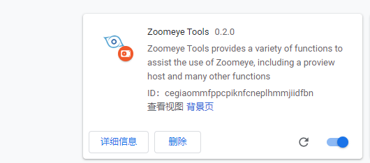

# Zoomeye Tools

Zoomeye Tools includes Zoomeye minitools and Zoomeye preview.

Minitools is currently integrated for use in zoomeye.org, copy all targets in multiple formats, and enter the next scan in a convenient and quick way.

Preview implements a simple Zoomeye interface. When a user login and clicks on preview, he can quickly and easily see various information of the current station ip and open port information.

Zoomeye Tools包括Zoomeye minitools以及Zoomeye preview两个功能。

minitools目前集成了针对zoomeye.org使用过程中，以多种格式复制所有目标，以方便快捷的方式进入下一步扫描。

preview实现了一个简易的Zoomeye界面，当用户登录并点开preview时，可以方便快捷的看到当前站ip的各种信息以及开放端口信息。

详细开发文档见：

- [https://lorexxar.cn/2020/02/03/chrome-ext-3/](https://lorexxar.cn/2020/02/03/chrome-ext-3/)

Chrome网上应用商店：

- [https://chrome.google.com/webstore/detail/zoomeye-tools/bdoaeiibkccgkbjbmmmoemghacnkbklj](https://chrome.google.com/webstore/detail/zoomeye-tools/bdoaeiibkccgkbjbmmmoemghacnkbklj)

# Usage

打开chrome，点开扩展程序

点击加载已解压的扩展程序，选到该项目下，即可加载插件

